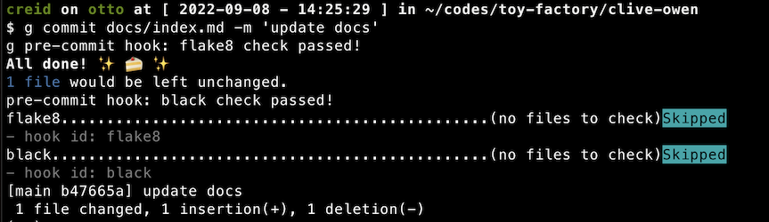

# clive-owen


A simple one-file CLI package. Demonstrates the following:

* How to implement a simple command line utility with Click, in a single .py file
* How to create a `setup.py` file alongside the CLI utility, for a bare-minimum installation
* How to implement git pre-commit hooks with [pre-commit](https://pre-commit.com/)



**Screenshot of pre-commit hooks in action.**

## Quick start

```
pip install --editable .
clive --help
```
